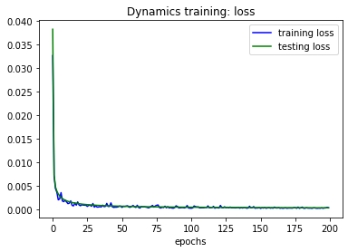
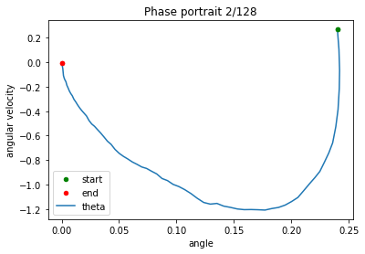
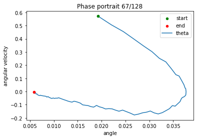
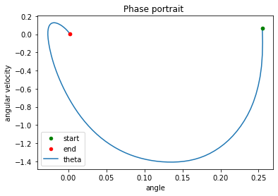
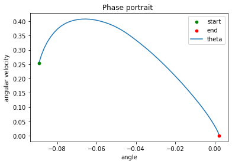
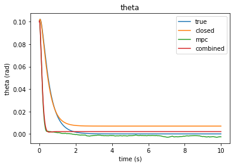
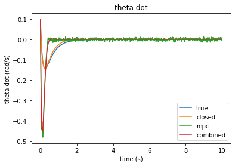
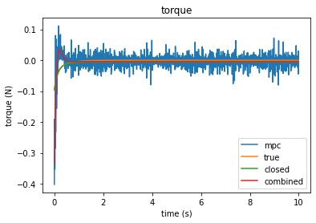

# learn-and-control

In this project we learn the dynamics of an inverted pendulum before learning a stabilizing policy from an MPC controller

This code is inspired by the IEEE paper:
["Neural Network Dynamics for Model-Based Deep Reinforcement Learning with Model-Free Fine-Tuning"](https://ieeexplore.ieee.org/abstract/document/8463189)
by Anusha Nagabandi, Gregory Kahn, Ronald S. Fearing and Sergey Levine from UC Berkeley.

---
# Project overview:
1. We learn the dynamics of the pendulum: given a state *s(t)* and an action *a(t)*, the neural net predicts the next state difference *s(t+dt)-s(t)*.
    
    
2. We use Model Predictive Control (MPC) to design expert stabilizing trajectories.
    
    

3. We use these expert trajectories to learn a stabilizing policy: given a state *s(t)*, the neural net predicts the action to take *a(t)*.
    
    
    
4. We combine the policy and dynamics into a single neural network: given a state *s(t)*, this network predicts the action to take *a(t)* and the resulting next state difference *s(t+dt)-s(t)*.
    
5. We compare the trajectories resulting from the different dynamics and policies. 

    | Label | Dynamics | Controller |
    | ----------- | ----------- | ---------- |
    | 'true' | true | linear controller |
    | 'closed' | learned | linear controller |
    | 'mpc' | learned | MPC |
    | 'combined' | learned | learned policy |

    
    
    

6. We verify whether this combined system verifies Lipschitz and Lyapunov properties.   NOT IMPLEMENTED yet.
